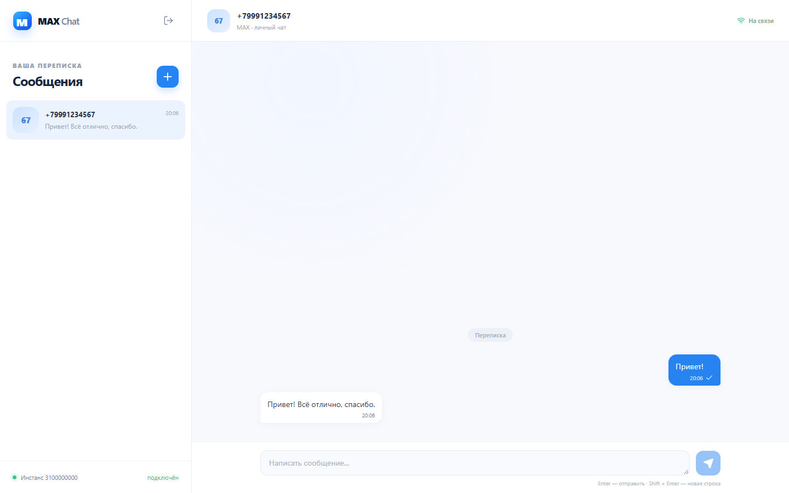

# MAX Chat

Минимальный веб-чат для личной текстовой переписки в MAX через GREEN-API. Пользователь подключает свой инстанс, создаёт чат по номеру телефона, отправляет сообщение и получает ответ в открытой переписке. Интерфейс сделан на React; небольшой Node.js сервер управляет сессией и очередью уведомлений.



## Возможности

- Подключение по `apiUrl`, `idInstance`, `apiTokenInstance` из кабинета GREEN-API.
- Проверка номера через `CheckAccount` и использование канонического `chatId`.
- Отправка текста через `SendMessage`, получение через `ReceiveNotification` с подтверждением `DeleteNotification`.
- Защита от повторного показа уведомлений, обработка ошибок API и адаптивный интерфейс.
- Токен не сохраняется в браузерном хранилище, файлах проекта или логах; сервер держит его только в памяти активной сессии.

## Требования

- Node.js 22.12+ и npm.
- Созданный и авторизованный в MAX инстанс [GREEN-API MAX](https://green-api.com/v3/docs/before-start/).
- В настройках инстанса включены входящие уведомления (`incomingWebhook: yes`), а `webhookUrl` оставлен пустым для режима [HTTP API](https://green-api.com/v3/docs/api/receiving/technology-http-api/). Без этого исходящие сообщения могут работать, но ответы не появятся.

Параметр `apiUrl` берётся из той же карточки инстанса, что ID и токен. Его нельзя заменить адресом сайта документации. Проверка номера в текущей версии GREEN-API MAX поддерживает номера России и Беларуси.

## Локальный запуск

```bash
git clone https://github.com/kakTyzZ/max-chat-react-test-assignment.git
cd max-chat-react-test-assignment
npm ci
npm run dev
```

Откройте `http://127.0.0.1:5187`. Vite проксирует `/api` на сервер по порту `8787`. На экране подключения введите данные инстанса. Реальные ключи в `.env` не требуются и не должны попадать в Git.

## Production-запуск

```bash
npm ci
npm run build
npm start
```

Сервер слушает `PORT` (по умолчанию `8787`) и раздаёт собранный клиент вместе с API. Для внешнего размещения нужен HTTPS и постоянно работающий Node.js процесс. Обычный статический хостинг для этой архитектуры не подходит: входящие уведомления обрабатываются сервером. Файл [.env.example](.env.example) показывает доступную настройку порта.

## Публичная демонстрация на Render Free

Репозиторий содержит [render.yaml](render.yaml) с бесплатным веб-сервисом. Откройте [создание сервиса из этого репозитория](https://render.com/deploy?repo=https%3A%2F%2Fgithub.com%2FkakTyzZ%2Fmax-chat-react-test-assignment), войдите в Render и подтвердите создание сервиса. После сборки адрес появится в панели Render в виде `https://…onrender.com`. Ключи GREEN-API вводятся на экране приложения; задавать их в настройках Render не нужно.

На бесплатном тарифе Render останавливает сервис через 15 минут без входящих запросов. Первое открытие после паузы может занять около минуты. Перезапуск очищает чаты и сессии из памяти, поэтому после него нужно подключиться заново. Для разовой проверки тестового задания этого достаточно.

## Проверки

```bash
npm run check       # типы, линтер, unit/контрактные тесты, сборка, production smoke
npm run test:e2e    # desktop/mobile сценарии в отдельном headless Edge
```

В E2E-запуске запросы к GREEN-API подменяются фикстурами, чтобы проверка была воспроизводимой и не требовала токена. Снимки в каталоге [screenshots](screenshots/) тоже сняты на демонстрационных данных. Browser QA использует аппаратный WebGL и отдельный профиль. На Windows тест выбирает установленный Edge; в других средах нужен Chromium Playwright (`npx playwright install chromium`) и доступный аппаратный WebGL. Путь к браузеру можно задать через `PLAYWRIGHT_BROWSER_PATH`.

## Как устроено

Клиент отправляет запросы только собственному серверу. Сервер проверяет данные, вызывает GREEN-API и хранит токен в памяти сессии с ограниченным временем жизни. После подключения запускается один последовательный потребитель уведомлений на инстанс. Он сохраняет текстовый ответ по `chatId`, исключает повторы по `idMessage` и только потом подтверждает уведомление. Клиент обновляет переписку каждые 2,5 секунды, пока вкладка видима.

Сообщения и чаты хранятся в памяти активного серверного процесса; после его перезапуска история очищается. Приложение рассчитано на один серверный процесс. Одновременная обработка той же очереди другим приложением или несколькими репликами сервера может перехватывать уведомления. Отправка `SendMessage` означает постановку в очередь GREEN-API, поэтому интерфейс не называет её гарантированной доставкой.

Действующий инстанс GREEN-API в автоматических проверках не использовался: проверены HTTP-контракты по документации и сценарии с подставными ответами. Публичная демонстрационная ссылка пока отсутствует; запуск и работа сервера описаны выше.

## Документы и исходное задание

- [Design Document](DESIGN.md)
- [План реализации](PLAN.md)
- [Отчёт о проверке](QA_REPORT.md)
- [Оригинал тестового задания](https://drive.google.com/file/d/1Ut39kkIs0QK-swnCsIPJc6pNqVIVGOD2/view)
- [Прототип интерфейса MAX](https://web.max.ru/)
